# Controle de Estoque com Django e PWA


</br> 
Este projeto implementa um sistema de controle de estoque utilizando Django, com suporte a Progressive Web App (PWA) para garantir uma experiência de aplicativo nativa.

## Recursos Principais

##  Requisitos Funcionais  

- **Cadastro de produtos** – Permite o registro e gerenciamento de produtos no estoque.  
- **Controle de validade** – Monitora a data de vencimento dos produtos.  
- **Relatórios personalizados** – Geração de relatórios sob demanda para análise e acompanhamento.  
- **Transferência de produtos** – Permite a movimentação de itens entre lojas e depósitos.  
- **Código de barras** – Suporte para leitura e geração de códigos de barras.  
- **Controle de acesso** – Gerenciamento de usuários com autenticação via **Login e Groups** do Django.  
- **Alertas inteligentes** – Notificações automáticas para validade e quantidade de produtos no estoque.  
- **Gestão de categorias** – Criação, edição e exclusão de categorias de produtos.  
- **Gestão de fornecedores** – Registro e gerenciamento de fornecedores.  
- **Movimentação de estoque** – Registro de entrada, saída e transferência de produtos.  
- **Transição entre lojas** – Usuários podem criar filiais e alternar entre elas, cada uma com seus próprios funcionários e produtos.  
- **Backup do sistema** – Endpoint específico para realizar backup dos dados: `<localhost>/api/backup/download/dados`.  

##  Requisitos Não Funcionais  

- **Camada de controle** – Restrições de usuários para garantir a integridade do sistema.  
- **Controle de rota** – Apenas usuários autenticados podem acessar determinadas páginas. A autenticação nativa do Django garante segurança e proteção de rotas sensíveis.  
- **Desempenho otimizado** – Utilização do **SQLite** como banco de dados devido à facilidade de implementação e ao baixo fluxo de acessos (diário ou semanal, dependendo do estabelecimento).  
- **Progressive Web App (PWA)** – Implementado para oferecer uma experiência mais fluida e próxima de um aplicativo nativo.  


##  Tecnologias Utilizadas  

O sistema foi desenvolvido utilizando:  

- **Django** (Backend)  
- **HTML, CSS, Tailwind CSS, JavaScript** (Frontend)  


  
### Progressive Web App (PWA)

- Instalação do sistema como aplicativo em dispositivos móveis e desktops.

### Dashboard

- Visualização de movimentações de estoque por categoria, fornecedor e produto.
- Exibição de métricas como quantidade total, movimentações e alertas (Dentro do proprio sistema) de estoque.

## Estrutura do Projeto

### Modelos Utilizados

1. **Loja**: Identificação da loja.
2. **Categoria**: Organização de produtos.
3. **Fornecedor**: Registro de fornecedores.
4. **Produto**: Detalhamento de produtos (nome, quantidade, validade, etc.).
5. **MovimentoEstoque**: Registro de movimentações de entrada, saída e transferência.
6. **User**: Usuario do proprio Django
7. **UserLoja**: Relação entre Loja e Usuario
   
### Views Principais

#### Dashboard

- **Endpoint**: `/dashboard`
- **Descrição**: Exibe as principais métricas do estoque e movimentações.

<div style="display: flex;"> 
   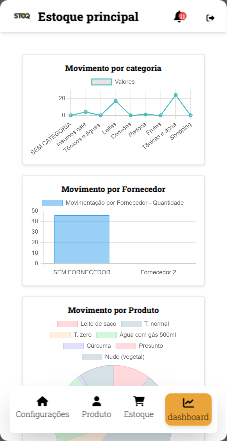 
   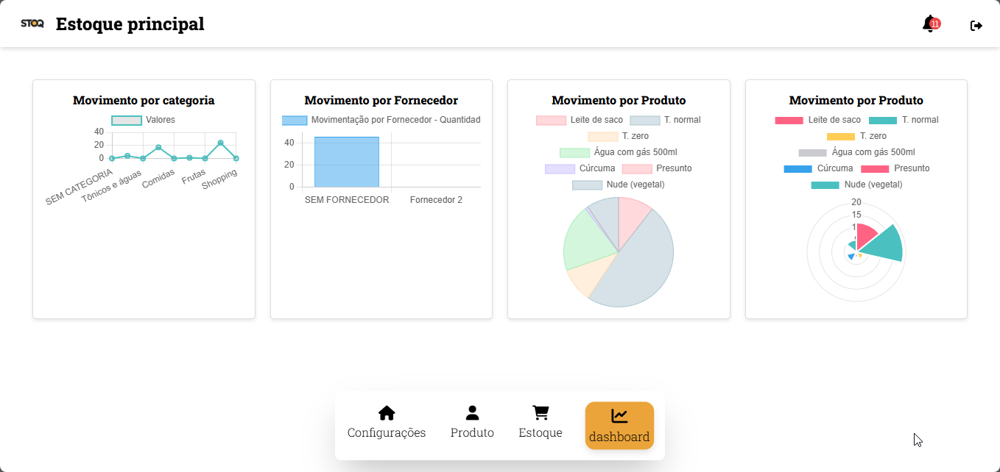 
</div>


#### Login e Logout

- **Endpoints**: `/login`, `/logout`
- **Descrição**: Gerencia autenticação e encerramento de sessões.
<div style="display: flex;"> 
   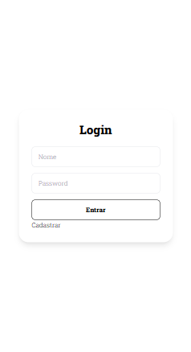 
   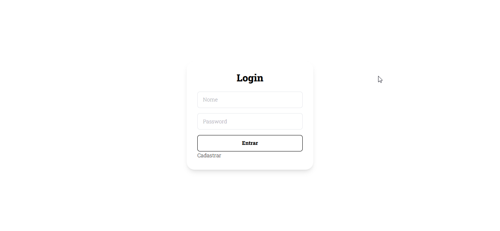 
</div>

#### Gestão de Produtos

- **Endpoints**: `/produtoview`, `/criar_produto`, `/editar_produto`, `/excluir_produto`
- **Descrição**: Manipula o CRUD de produtos.


#### Gestão de Categorias

- **Endpoints**: `/listar_categorias`, `/criar_categoria`, `/editar_categoria`, `/excluir_categoria`
- **Descrição**: Manipula o CRUD de categorias.

#### Gestão de Fornecedores

- **Endpoints**: `/listar_fornecedores`, `/criar_fornecedor`, `/editar_fornecedor`, `/excluir_fornecedor`
- **Descrição**: Manipula o CRUD de fornecedores.
  
<div style="display: flex;"> 
   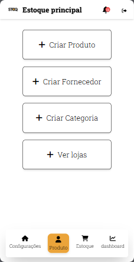 
   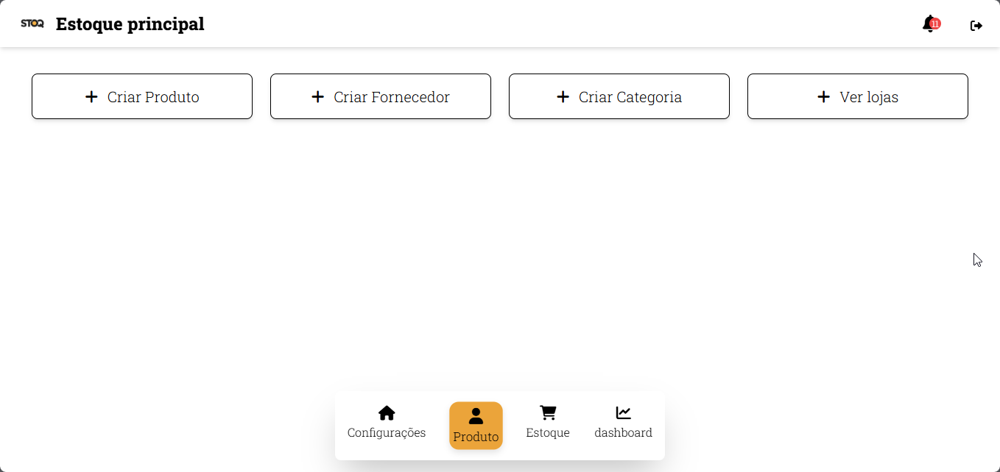 
</div>

#### Movimentação de Estoque

- **Endpoint**: `/cria_movimento_de_estoque_em_lote`
- **Descrição**: Registra entradas, saídas e transferências de produtos entre lojas.

<div style="display: flex;"> 
   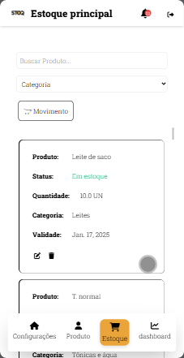 
   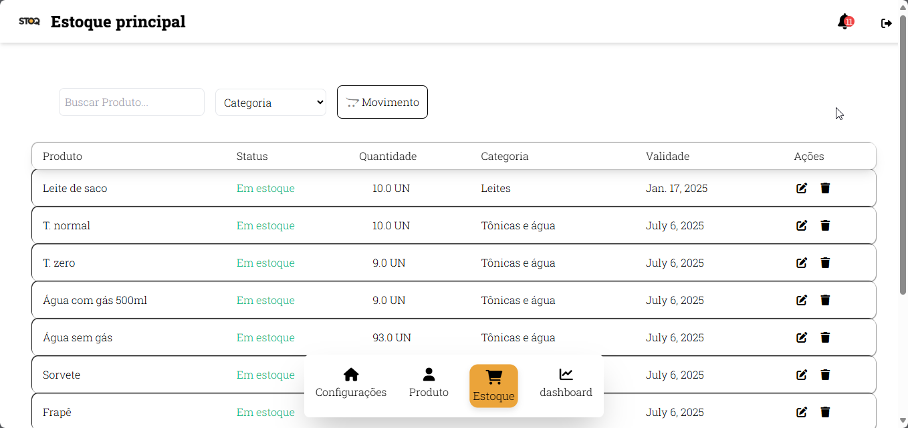 
</div>


#### Cadastro Loja-User

- **Função**: `cadastroUserLoja`
- **Descrição**: Função para cadastrar um usuário proprietário de uma loja:
  - Cadastro de Usuario e Loja. O usuario cadastro desta maneira pertece ao grupo de proprietario.

<div style="display: flex;"> 
   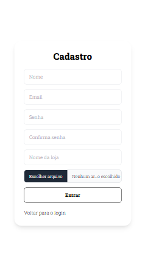 
   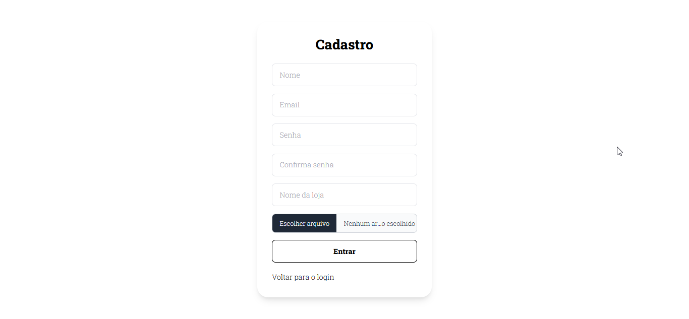 
</div>

#### Notificações

- **Função**: `func_notifica_vencimento`
- **Descrição**: Gera alertas para:
  - Produtos com validade próxima (14, 30 ou 60 dias).
  - Produtos com estoque abaixo do mínimo.
<div style="display: flex;"> 
   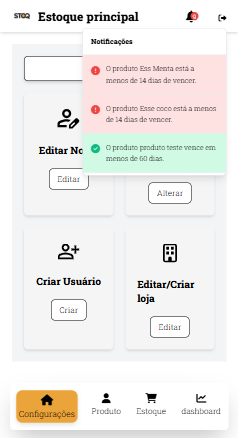 
   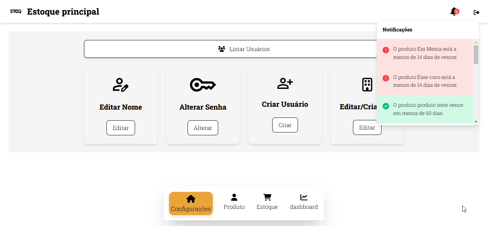 
</div>


## 🚀 Instalação  

1. **Clone o repositório**:  

   ```bash
   git clone <url-do-repositorio>
   cd <nome-do-projeto>
   ```

2. **Crie um ambiente virtual e ative-o**:  

   ```bash
   python -m venv venv
   source venv/bin/activate  # No Windows: venv\Scripts\activate
   ```

3. **Instale as dependências**:  

   ```bash
   pip install -r requirements.txt
   ```

4. **Aplique as migrações do banco de dados**:  

   ```bash
   python manage.py migrate
   ```

5. **Crie um superusuário para acessar o admin**:  

   ```bash
   python manage.py createsuperuser
   ```

   - Insira um **nome de usuário**, **email** (opcional) e **senha** quando solicitado.

6. **Inicie o servidor de desenvolvimento**:  

   ```bash
   python manage.py runserver
   ```

7. **Acesse o painel administrativo do Django**:  

   - Abra o navegador e vá para: [`http://127.0.0.1:8000/admin/`](http://127.0.0.1:8000/admin/)  
   - Faça login com as credenciais do **superusuário** criado.  


## Design

O design do sistema é responsivo e otimizado para dispositivos móveis e desktops, utilizando o seguinte:

- **HTML5**
- **CSS3**
- **Tailwind**
- **Templates Django**


## Sobre o autor

<!-- Coloque seu nome, uma foto sua e uma pequena bio sobre você na seguinte tabela: -->
|  |  |
|:-------------:|:------------------------------------------------------------:|
|  </br> **Alan Bruno Morais Costa** | 
Meu nome é Alan, sou estudante de Ciências da Computação na Universidade Federal de Mato Grosso (UFMT). Atualmente, estou focado em aprimorar minhas habilidades em desenvolvimento de software, com ênfase em boas práticas de programação, arquitetura de sistemas e tecnologias modernas.   |

- **Email:** alanbrunomoraescosta18@hotmail.com
- **LinkedIn:** [Alan's LinkedIn](https://www.linkedin.com/in/alan-morais-4861322b0)

